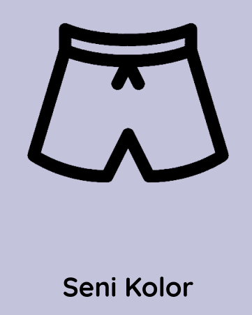
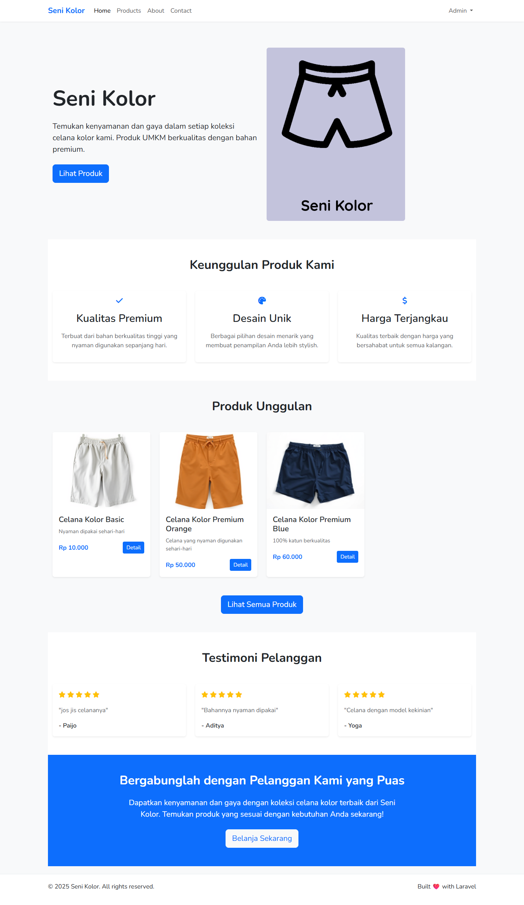
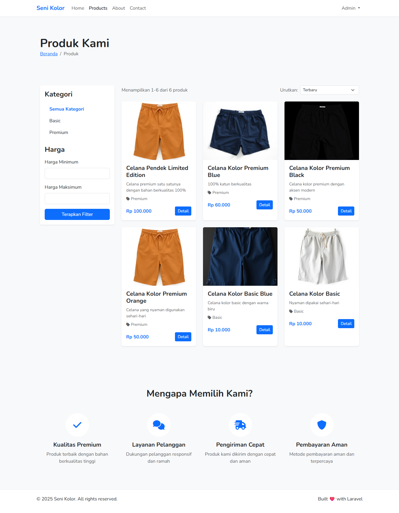
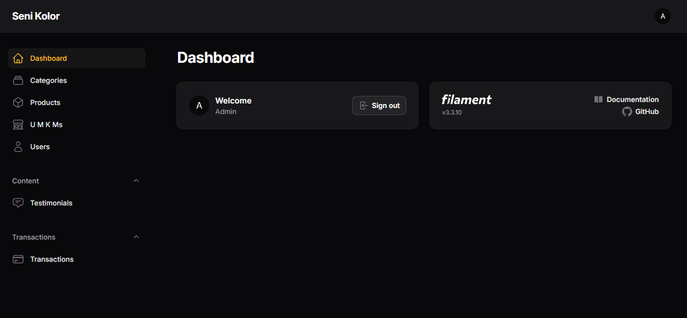

  

  
  
  
  

---

## 🌟 Tentang Seni Kolor

**Seni Kolor** adalah platform e-commerce yang menjual produk celana kolor berkualitas tinggi. Platform ini menggabungkan teknologi modern dengan kebutuhan bisnis lokal, memberikan pengalaman berbelanja yang nyaman dan sistem manajemen yang efisien.

### 🎯 Visi & Misi

**Visi:** Menjadi brand celana kolor terdepan di Indonesia yang dikenal karena kualitas, kenyamanan, dan dukungan terhadap UMKM lokal.

**Misi:**
- 🛍️ Memproduksi celana kolor berkualitas tinggi dengan desain modern
- 🤝 Memberikan pengalaman berbelanja yang menyenangkan
- 🚀 Mendukung perkembangan UMKM lokal di Indonesia

---

## ⭐ Fitur Utama

### 🛒 **E-Commerce Core**
- **Katalog Produk** - Tampilan produk yang menarik dengan detail lengkap
- **Keranjang Belanja** - Sistem keranjang yang responsif dan user-friendly
- **Checkout & Payment** - Proses pembayaran yang aman dan mudah

### 👨‍💼 **Admin Dashboard (Filament)**
- **📊 Dashboard Analytics** - Laporan penjualan dan statistik lengkap
- **🏪 UMKM Management** - Kelola data UMKM dan produk
- **📦 Product Management** - CRUD produk dengan upload gambar
- **💳 Transaction Management** - Monitor dan kelola semua transaksi
- **👥 User Management** - Manajemen pengguna dan role
- **🖼️ Payment Proof** - Verifikasi bukti pembayaran

### 🔐 **Multi-Authentication API**
- **🔑 JWT Authentication** - Token-based authentication untuk mobile app
- **🔐 Basic Authentication** - Username/password authentication
- **🗝️ API Key Authentication** - Secure API access dengan key
- **📚 Swagger Documentation** - Dokumentasi API lengkap dan interaktif

### 💰 **Payment System**
- **Bank Transfer** - Sistem pembayaran via transfer bank
- **Payment Proof Upload** - Upload bukti pembayaran dengan validasi
- **WhatsApp Integration** - Komunikasi langsung dengan penjual

---

## 🚀 Demo & Screenshots

### 🏠 **Homepage**

  

### 🛍️ **Product Catalog**

  

### 📊 **Admin Dashboard**

  

---

## 🛠️ Tech Stack

### **Backend**
-  **Laravel 10.x** - PHP Framework
-  **PHP 8.1+** - Server-side Language
-  **MySQL** - Database
-  **Filament Admin** - Admin Panel

### **Frontend**
-  **Bootstrap 5.3** - CSS Framework
-  **Vanilla JavaScript** - Frontend Logic
-  **Font Awesome** - Icons

### **API & Documentation**
-  **L5-Swagger** - API Documentation
-  **JWT Auth** - Token Authentication
-  **Postman** - API Testing

---

  

